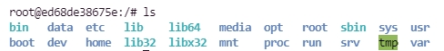

<a name="top"></a>
<div style="float:right"> 


 </div>

# Docker Volumes
A Docker volume is a directory (or collection of files) that lives on the host file system and is not a part of the container’s UFS. It is within these volumes that containers are capable of saving data. With the docker volume command, you can easily manage volumes to expand your containers well beyond their basic capability.

Let’s find out how to deploy a new container that includes a volume attached to a specific directory on a host such that the container will stay in sync with the data in the volume. I will assume you already have Docker up and running and can deploy containers.

## Table of contents
* [Creating the Host Data Volume](#creating-the-host-data-volume)
* [Technologies](#technologies)

---

<div style="float:right"> 

[top](#top)

 </div>
	
## Creating the Host Data Volume
Create a new directory to house the volume. Open a terminal window and issue the command:

```Powershell
mkdir ~/container-data
```

Once you’ve created that directory, you’re ready to mount a volume inside. Let’s say you’re going to deploy a container, based on the official Ubuntu image, that contains a directory called /data. To deploy such a container that attaches the internal /data directory to a volume within the host directory ~/container-data, you would issue the command:

```Powershell
docker run -dit -P --name ubuntu-test -v ~/container-data:/data ubuntu
```

<!--
ed68de38675
-->

The above command breaks down like this:

* _docker run_ is the main command that says we’re going to run a command in a new container.
* -dit is d for detached mode, and it ensures that bash or sh can be allocated to a pseudo terminal.
* -P publishes the containers ports to the host.
* –name says what follows is the name of the new container.
* -v says what follows is to be the volume.
* ubuntu is the image to be used for the container.

Once the command completes, you will be given a container ID (Figure A). Make sure to remember the first four characters of that ID, as you’ll need it to gain access to the container bash prompt.

---

<div style="float:right"> 

[top](#top)

 </div>
	

## Testing the Volume
Let’s test this volume. If you’ve forgotten the ID of the container, issue the following command to see it listed

```Powershell
docker ps -a
```

Access the newly-deployed container with the command:

```Powershell
docker attach <IMAGE_ID>
```


Where ID is the first four characters of the deployed container. You should now find yourself at the bash prompt within the container. Issue the command ls / and you will see the /data directory added to the Ubuntu container.

```console
~/projects/docker-volumes$ docker attach ed68de38675
/# ls
```



Let’s create a test file in that directory with the command:

<pre>
<strong>_root@ed68de38675e:_</strong>/# <strong>touch</strong> /data/test
</pre>

After creating this test file, _open another terminal window_ on the host machine and issue the command ls ~/container-data. You should see the test file within that directory


<pre>
<strong>myuser@mymachine:</strong> \~\$ cd ~/container-data 
<strong>myuser@mymachine:</strong> ~/container-data$ ls \
_testfile_ 
<strong>myuser@mymachine:</strong> ~/container-data$ 
</pre>

You’ve just deployed a container that includes persistent storage, via a volume on the host.

---
 
<div style="float:right"> 

[top](#top)

 </div>
	

## Database Volume


<div style="float:right"> 

[top](#top)

 </div>

### Named Volumes


<details>
  <summary>Manually Add Named Volume</summary>

<pre>	
<strong>myuser@mymachine:</strong>~/projects/docker-volumes$ docker volume create mysql-test 
mysql-test 
<strong>myuser@mymachine:</strong>~/projects/docker-volumes$ docker volume list 
DRIVER    VOLUME NAME 
local     mysql-test 
local     vscode 
<strong>myuser@mymachine:</strong>~/projects/docker-volumes$ docker volume inspect mysql-test  
 [
         {
             "CreatedAt": "2021-10-25T20:15:19Z",
             "Driver": "local",
             "Labels": {},
             "Mountpoint": "/var/lib/docker/volumes/mysql-test/_data",
             "Name": "mysql-test",
             "Options": {},
             "Scope": "local"
         }
     ]  
<strong>myuser@mymachine:</strong>~/projects/docker-volumes$ docker volume rm mysql-test  
mysql-test  
<strong>myuser@mymachine:</strong>~/projects/docker-volumes$ docker volume list  
DRIVER    VOLUME NAME   
local     vscode  
</pre>
</details>


---

### Create Image for MySQL with Named Volume

Let’s say you want to create a volume for a database. You can do this by first deploying a **MySQL** database Docker container and instructing it to use a persistent storage volume named **mysql-data**. Do this with the command:


<details>
<summary>MySQL with Named Volume </summary>

<p>

```bash

docker run --name mysql-test -v mysql-data:/var/lib/mysql -e MYSQL_ROOT_PASSWORD=Pass2020! -p 3306:3306 -d mysql:latest


```

**Note:**  In the above command, the -e switch informs docker what follows is an environment variable.
</p>
</details>  

---
### Create Image for PostGreSQL with Named Volume

To repeat this process for PostGreSQL. You can do this by first deploying a PostGreSQL database Docker container and instructing it to use a persistent storage volume named **postgres-data**. 


<details>
<summary>PostGreSQL with Named Volume </summary>

<p>

```bash

docker run -d --name dev-postgres -e POSTGRES_PASSWORD=Pass2020! -v postgres-data:/var/lib/postgresql/data -p 5432:5432 postgres

```

**Note:**  The default username is postgres; Use this when trying to connect
</p>
</details>  

---
### Create Image for MS SQL Server with Named Volume

To repeat this process for MS SQL Server. You can do this by first deploying a MS SQL Server database Docker container and instructing it to use a persistent storage volume named **mssql-data**. 


<details>
<summary>SQL Server with Named Volume </summary>

<p>

```bash

docker run -e 'ACCEPT_EULA=Y' -e 'SA_PASSWORD=Pass2020!' -v mssql-data:/var/opt/mssql -p 1433:1433 --name dev-mssql -h dev-mssql -d mcr.microsoft.com/mssql/server:2019-latest 

```
	
Connect to the container
	
```bash
docker exec -it dev-mssql /opt/mssql-tools/bin/sqlcmd -S localhost -U sa -P Pass2020!
```
Run the SQL commands (some DB tools need a database to exist before connecting)
```console
1> create database mydb
2> go
```
	
	
[DockerHub - Microsoft SQL Server](https://hub.docker.com/_/microsoft-mssql-server)
</p>
</details>  
